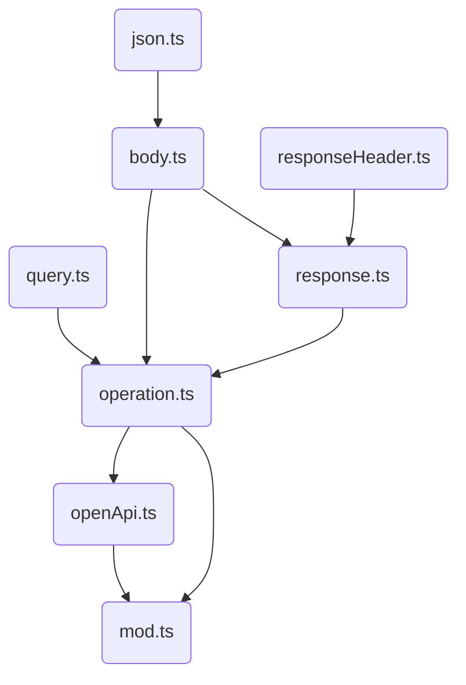

# http-server

```mermaid
graph TD;

mod(mod.ts)
json(json.ts)
openApi(openApi.ts)
query(query.ts)
body(body.ts)
response(response.ts)
responseHeader(responseHeader.ts)
operation(operation.ts)

json --> body
query --> operation
body --> operation
responseHeader --> response 
body --> response
response --> operation
operation --> openApi
operation --> mod
openApi --> mod
```
